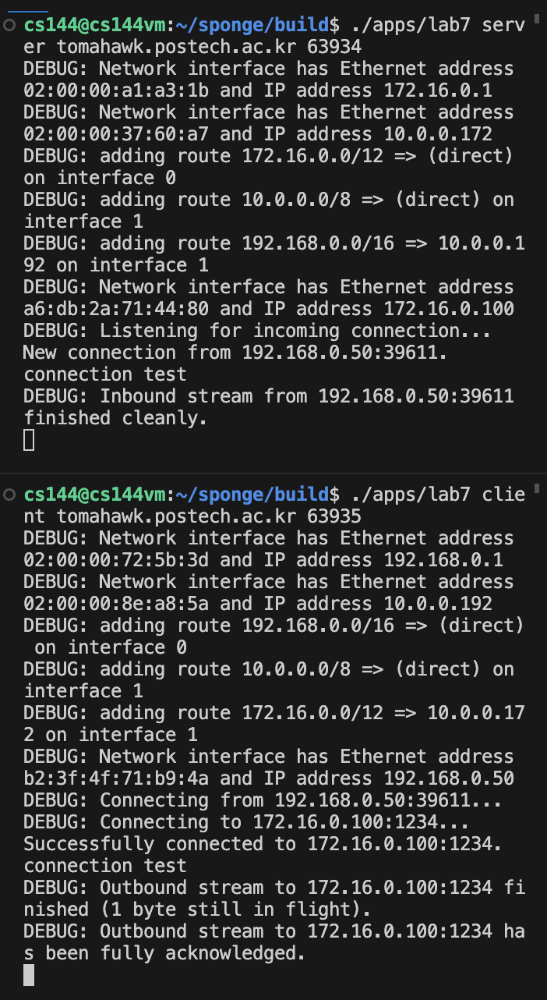
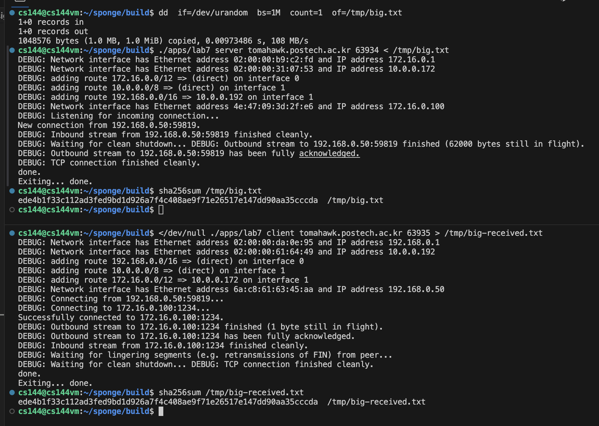
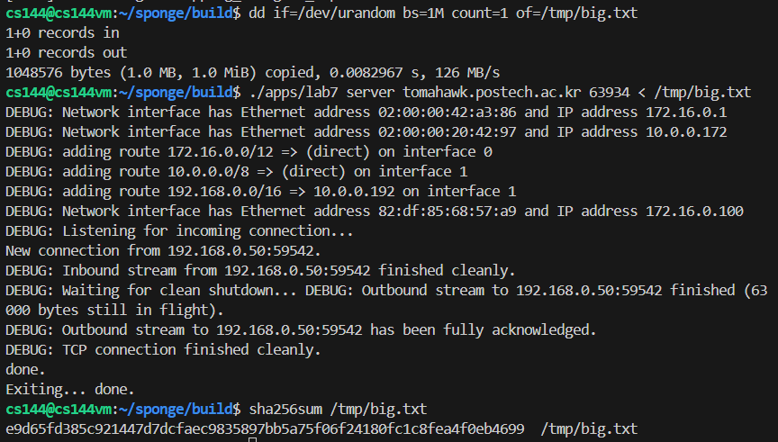
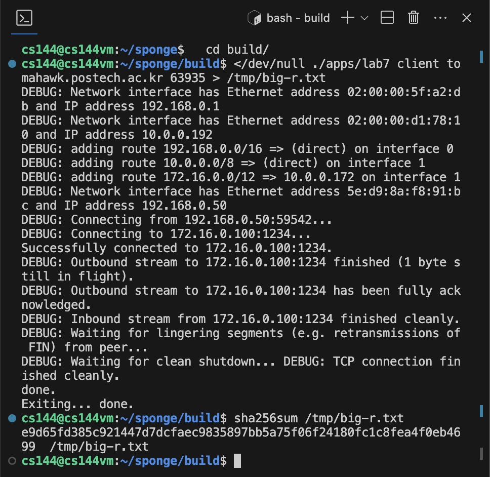

Assignment 7 Writeup
=============

My name: Jiwoo Hong

My POVIS ID: jiwooh

My student ID (numeric): 20220871

My assignment partner's name: JunHyeok Park

My assignment partner's POVIS ID: joon363

My assignment partner's ID (numeric): 20220312

This assignment took me about [n] hours to do (including the time on studying, designing, and writing the code).

If you used any part of best-submission codes, specify all the best-submission numbers that you used (e.g., 1, 2): None

- **Caution**: If you have no idea about above best-submission item, please refer the Assignment PDF for detailed description.

Solo portion:
1. My implementation successfully started and ended a conversation with another copy of itself.

2. It successfully transfered a one-megabyte file with contents identical upon receipt.

3. No code changes were needed.

Group portion:
1. My team name is `Engelbart`.
2. Our implementations successfully started and ended a converstaion with each other.
3. We successfully transfered a one-megabyte file between our two implementations with contents identical upon receipt.

4. No code changes were needed.

Other remarks: None